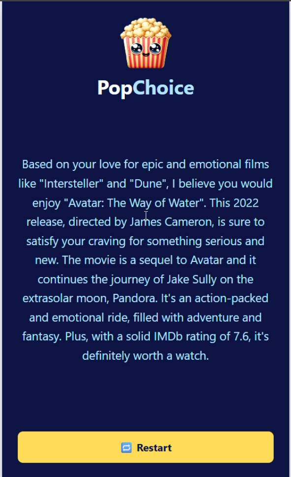

# 🍿 PopChoice — AI Movie Recommendation App

**PopChoice** is an interactive AI-powered movie recommendation app that uses user preferences to find the perfect film match. Built with React, Tailwind CSS, and a smart embedding-based backend, it analyzes user inputs and compares them to a curated database of movie plots and metadata.

---

## 🚀 Features

- 🧠 AI-driven movie suggestions based on semantic similarity  
- 🎬 Questions to capture mood, theme, and tone  
- 🖼️ Clean, responsive UI with PopChoice branding  
- 🔁 Restart option for trying new preferences  
- ⚡ Real-time API integration with loading states  

---

## 🧪 How It Works

1. The user answers 3 questions:
   - Favorite movie & why
   - Preference: new or classic
   - Mood: fun or serious
2. These answers are combined into a single input and sent to:
   ```
   https://pop-choice-app-5xe4r.ondigitalocean.app/api/embed/userInputs
   ```
3. The backend uses embedding comparison to recommend the most semantically similar movie from a pre-embedded list.
4. Recommendation is displayed with a simple restart option.

---

## 🗂️ Folder Structure

```
PopChoice/
├── public/
│   └── assets/
│       └── PopChoice Icon.png
├── src/
│   ├── App.jsx
|   ├── main.jsx
|   ├── index.css
│   └── PopChoice.jsx
├── index.jsx         # Embedding data uploader (outside src)
├── content.js        # Movie data for embeddings
└── package.json
```

---

## 🧠 Movie Dataset (Embedding Input)

Movies are stored as an array of objects in `content.js`. Each entry includes:

- `title`
- `releaseYear`
- `content` (used for embedding)

Example:

```js
{
  title: "Oppenheimer",
  releaseYear: "2023",
  content: "Oppenheimer (3 hr): The story of American scientist, J. Robert Oppenheimer... Rated 8.5 on IMDB"
}
```

The `index.jsx` file handles bulk uploading of this data to your embedding backend.

---

## 🖥️ UI Preview

The app presents a full-page, mobile-friendly card layout:

- 🧾 **Input Form:** Three thoughtfully designed prompts  
- ⚙️ **Real-time Feedback:** Loading state + transition  
- ✅ **Recommendation View:** Bold, readable, colored result  

---

## 📦 Installation & Development

```bash
# Install dependencies
npm install

# Run the app in dev mode
npm run dev

# Build production version
npm run build

# Preview production build
npm run preview
```

---

## 📸 Screenshot




---

## 🌐 Deployments

- Vercel  
- DigitalOcean App Platform (API)   

---

## 🛠️ Tech Stack

| Tech        | Purpose                     |
|-------------|-----------------------------|
| React 19    | Frontend framework          |
| TailwindCSS | Styling                     |
| Vite        | Build tool                  |
| DigitalOcean| API hosting for embeddings  |
| Embeddings  | Movie similarity comparison |
| Embeddings and data saving  | Supabase vector database |

---

## 💡 Future Improvements

- 🎙️ Voice-based input  
- 🧠 Chat-style interface option  
- 🔍 Filter by genre / duration  
- 🔒 Auth to track history or save recommendations  

---

## 👨‍💻 Author

**Anuj Kumar Maurya**  
Fullstack Developer | AI Enthusiast  
🔗 [GitHub](https://github.com/codeXanu)

---